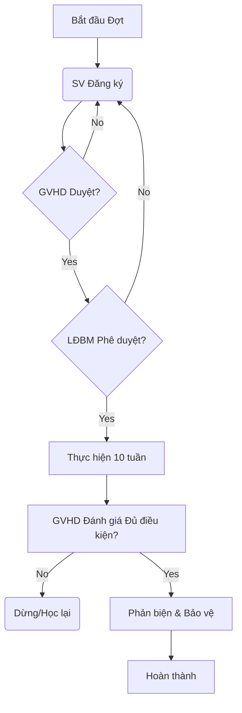
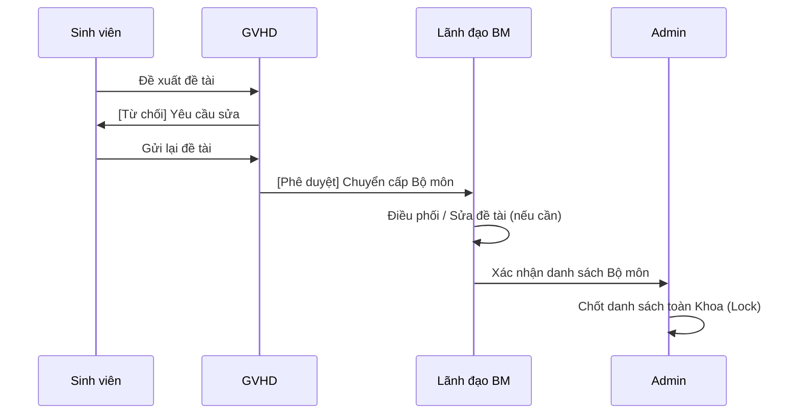

# Kế hoạch triển khai Hệ thống Quản lý Đồ án (Tập trung: Admin)

Kế hoạch này tập trung vào việc xây dựng bộ công cụ quản trị mạnh mẽ cho **Admin (Khoa/Phòng Đào tạo)**, đóng vai trò là "Tổng chỉ huy" cho toàn bộ quy trình đồ án.

## User Review Required

> [!IMPORTANT]
> - **Cơ chế Đợt đăng ký**: Tôi đề xuất sử dụng một Model `Period` riêng biệt thay vì chỉ dùng một biến đơn lẻ trong Config. Điều này cho phép lưu trữ lịch sử các năm học trước.
> - **Quyền chốt danh sách**: Admin sẽ có quyền "Khóa toàn hệ thống" sau khi các Bộ môn đã rà soát xong.

## Đối tượng 1: Admin (Khoa/Phòng Đào tạo)

### 1.1. Quản lý toàn bộ hệ thống
- **Mục tiêu**: Quản trị dữ liệu gốc (Giảng viên, Sinh viên, Chuyên ngành).
- **Công việc**:
  - Tối ưu hóa giao diện Quản lý Giảng viên/Sinh viên (thêm chức năng lọc, tìm kiếm).
  - Quản lý phân quyền (`subRoles`) tập trung tại một giao diện duy nhất.

### 1.2. Tạo đợt đăng ký đồ án
- **[NEW] Model [period.js](file:///d:/hoc_html/on_html/project2/src/app/models/period.js)**:
  - Trường dữ liệu: `semester`, `year`, `startDate`, `endDate`, `status: ['ACTIVE', 'CLOSED']`.
- **Giao diện Admin**: Form khởi tạo đợt mới, thiết lập thời gian nộp đề tài và thời gian bảo vệ dự kiến.

### 1.3. Chốt danh sách cuối cùng
- **Logic**: Sau khi LĐBM đã phê duyệt các cặp SV-GV, Admin thực hiện lệnh **Finalize All**.
- **Hành động**: Chuyển trạng thái hàng loạt đồ án sang `DANG_THUC_HIEN` và khóa (`isLocked: true`) mọi thay đổi về đề tài/GVHD.

### 1.4. Tạo hội đồng bảo vệ
- **Logic**: Admin thiết lập danh sách các Hội đồng chung của Khoa.
- **Giao diện**:
  - Gán Chủ tịch (Chairman), Thư ký (Secretary), Ủy viên (Members).
  - Phân bổ các phòng bảo vệ và khung giờ (Time slots).
  - Ghép nhóm Sinh viên vào các Hội đồng này.

### 1.5. Xem báo cáo tổng hợp
- **Báo cáo Dashboard**:
  - Thống kê tỷ lệ hoàn thành theo từng Bộ môn.
  - Thống kê điểm số trung bình (Bell curve).
  - Xuất báo cáo tổng kết (Excel/PDF) để lưu trữ tại Phòng Đào tạo.

## Câu hỏi mở

- **Kiểm soát Đợt**: Bạn có muốn hệ thống tự động khóa khi hết hạn `endDate`, hay Admin phải bấm nút chốt thủ công?
- **Phân bổ Hội đồng**: Admin sẽ gán từng sinh viên vào Hội đồng, hay Admin chỉ tạo Hội đồng còn LĐBM sẽ tự gán sinh viên của Bộ môn mình vào đó?
- **Báo cáo**: Bạn có yêu cầu mẫu báo cáo đặc thù nào từ phía Nhà trường không?

## Kế hoạch Xác minh

### Kiểm thử Admin
- Kiểm tra tính năng tạo Đợt mới và xác nhận SV không thể đăng ký nếu ngoài thời gian quy định.
- Kiểm tra tính năng gán Hội đồng và đảm bảo thông báo được gửi đến toàn bộ thành viên.

## Đối tượng 2: Sinh viên (SV)

### 2.1. Đăng ký đề tài & Đề xuất GVHD
- **Giao diện**: Form đăng ký bao gồm Tên đề tài, Nội dung tóm tắt, Công nghệ sử dụng.
- **Tính năng đề xuất**:
  - SV chọn GVHD từ danh sách giảng viên trong cùng chuyên ngành.
  - Hệ thống tự động gửi yêu cầu đến GVHD được chọn.
- **Ràng buộc**: Chỉ được đăng ký nếu đồ án hiện tại đang ở trạng thái `null` hoặc `REJECTED` và nằm trong Đợt đăng ký (`Period`) đang mở.

### 2.2. Nộp báo cáo tiến độ (10 Tuần)
- **Giao diện Timeline**: Hiển thị danh sách các mốc thời gian (Milestones) do GVHD thiết lập.
- **Tính năng nộp**:
  - Tải lên file (PDF/Zip) và mô tả nội dung công việc.
  - Sau khi nộp, GVHD sẽ nhận được thông báo để vào nhận xét.

### 2.3. Nộp báo cáo cuối
- **Điều kiện**: SV chỉ được nộp bản cuối khi đã hoàn thành các mốc báo cáo tiến độ và được GVHD xác nhận.
- **Hành động**: Bản báo cáo cuối sẽ là căn cứ để LĐBM phân công Giáo viên phản biện (GVPB).

### 2.4. Xem kết quả
- **Dashboard cá nhân**:
  - Xem điểm chi tiết từ GVHD, GVPB và Hội đồng (sau khi đã chốt).
  - Xem biên bản góp ý từ Hội đồng bảo vệ để hoàn thiện đồ án.

## Đối tượng 3: Giáo viên hướng dẫn (GVHD)

### 3.1. Duyệt / Từ chối đề tài
- **Quản lý yêu cầu**: GVHD nhận được danh sách các đề tài mà sinh viên đã đề xuất.
- **Hành động**:
  - **Duyệt**: Đồ án chuyển sang trạng thái `CHO_LDBM_DUYET`. GVHD bắt đầu thiết lập lộ trình.
  - **Từ chối**: Phải kèm theo lý do để sinh viên điều chỉnh hoặc đăng ký giáo viên khác.

### 3.2. Tạo Milestones (Cột mốc) & Theo dõi tiến độ
- **Thiết lập lộ trình**: Sau khi duyệt đề tài, GVHD tạo danh sách các cột mốc (tuần 1 - tuần 10).
- **Dashboard quản lý**: Xem biểu đồ tiến độ phần trăm (`progress.percent`) của tất cả sinh viên mình đang hướng dẫn.

### 3.3. Nhận xét hàng tuần
- **Tương tác**: GVHD xem nội dung báo cáo và file đính kèm của SV hàng tuần.
- **Phản hồi**: Viết nhận xét trực tiếp trên bản báo cáo. Có quyền yêu cầu SV nộp lại nếu nội dung không đạt yêu cầu.

### 3.4. Đánh giá đủ điều kiện bảo vệ
- **Quyết định cuối kỳ**: Dựa trên quá trình thực hiện 10 tuần, GVHD xác nhận SV có đủ điều kiện để ra bảo vệ hay không.
- **Chuyển giao**: Khi GVHD xác nhận "Đạt", trạng thái đồ án sẽ chuyển sang `CHO_PHAN_BIEN`.

## Đối tượng 4: Lãnh đạo bộ môn (LĐBM)

### 4.1. Phê duyệt đề tài cấp bộ môn
- **Rà soát**: Sau khi GVHD duyệt, LĐBM thực hiện rà soát cuối cùng về tính khả thi và khối lượng của đề tài.
- **Hành động**: Phê duyệt chính thức đề tài để chuyển sang trạng thái `DANG_THUC_HIEN`.

### 4.2. Phân công Giáo viên hướng dẫn (GVHD)
- **Điều phối**: Trong trường hợp sinh viên bị GVHD từ chối đề xuất hoặc chưa tìm được GVHD, LĐBM có quyền chỉ định trực tiếp giảng viên phù hợp cho sinh viên.
- **Đảm bảo**: Kiểm soát định mức số lượng sinh viên tối đa của mỗi giảng viên trong bộ môn.

### 4.3. Phân công Giáo viên phản biện (GVPB)
- **Quy trình**: Khi đồ án hoàn thành 10 tuần, LĐBM chọn giảng viên có chuyên môn tương đương để phản biện.
- **Ràng buộc**: Hệ thống tự động ngăn chặn việc gán GVPB trùng với GVHD của chính đồ án đó.

### 4.4. Lập Hội đồng bảo vệ
- **Phối hợp**: LĐBM có thể trực tiếp thiết lập hội đồng cho các chuyên ngành thuộc bộ môn mình quản lý (tương tự chức năng của Admin).
- **Chi tiết**: Gán thành viên, phòng, thời gian và danh sách sinh viên bảo vệ.

## Đối tượng 5: Giáo viên phản biện (GVPB)

### 5.1. Đọc đồ án
- **Quyền truy cập**: Sau khi được LĐBM phân công, GVPB có quyền truy cập vào bản báo cáo cuối và mã nguồn (nếu có) của sinh viên.
- **Tính năng**: Giao diện đọc file trực tuyến hoặc tải xuống để thẩm định.

### 5.2. Nhận xét độc lập
- **Nghiệp vụ**: GVPB viết bản nhận xét đánh giá chất lượng đồ án dựa trên các tiêu chí (tính mới, tính ứng dụng, độ hoàn thiện).
- **Tính bảo mật**: Nhận xét của GVPB là độc lập và không phụ thuộc vào đánh giá của GVHD.

### 5.3. Kết luận: Đạt / Không đạt
- **Quyết định**: GVPB đưa ra kết luận cuối cùng về việc sinh viên có được phép ra bảo vệ trước Hội đồng hay không.
- **Hành động**:
  - **Đạt**: Đồ án chuyển sang trạng thái `CHO_BAO_VE`.
  - **Không đạt**: Đồ án dừng lại, sinh viên nhận thông báo và phải đợi đợt sau.

## Đối tượng 6: Hội đồng bảo vệ (Council)

### 6.1. Cơ cấu Hội đồng
- **Chủ tịch**: Người điều hành buổi bảo vệ, có quyền duyệt điểm cuối cùng và chốt trạng thái hoàn thành.
- **Thư ký**: Người trực tiếp nhập các câu hỏi phản biện, ghi nhận biên bản và tổng hợp điểm trung bình.
- **Ủy viên**: Tham gia đặt câu hỏi và chấm điểm độc lập cho sinh viên.

### 6.2. Chấm điểm bảo vệ & Nhập điểm
- **Tính năng**: Mỗi thành viên hội đồng có giao diện nhập điểm riêng cho từng sinh viên trong danh sách bảo vệ.
- **Quy trình**:
  - Các thành viên nhập điểm cá nhân.
  - Thư ký thực hiện lệnh "Tổng hợp điểm" để tính điểm trung bình cộng.

### 6.3. Ghi nhận biên bản
- **Nghiệp vụ (Thư ký)**: Nhập nội dung các câu hỏi Hội đồng đưa ra và phần trả lời của sinh viên.
- **Kết luận**: Ghi nhận kết luận chung của Hội đồng về đồ án.
- **Hành động (Chủ tịch)**: Kiểm tra biên bản và điểm số, sau đó thực hiện lệnh "Phê duyệt cuối cùng" để chuyển trạng thái đồ án sang `HOAN_THANH`.

## II. 🔄 QUY TRÌNH NGHIỆP VỤ (BUSINESS PROCESS)

### 🟢 GIAI ĐOẠN 1: ĐĂNG KÝ & XÉT DUYỆT

#### 1. Khởi tạo Đợt đăng ký (Admin)
- **Luồng chính**: Admin truy cập module Quản lý đợt để thiết lập thông số cho học kỳ mới.
- **Các thiết lập quan trọng**:
  - **Thời gian bắt đầu / kết thúc**: Hệ thống chỉ cho phép Sinh viên đăng ký đề tài và GVHD duyệt đề tài trong khoảng thời gian này.
  - **Số lượng SV tối đa / GV**: Thiết lập hạn mức (Quota) cho mỗi giảng viên (VD: Mỗi GV chỉ được hướng dẫn tối đa 10 SV) để đảm bảo chất lượng.

#### 2. Sinh viên đăng ký đề tài (SV)
- **Đăng ký mới**: SV truy cập form đăng ký và nhập các thông tin bắt buộc:
  - **Tên đề tài**: Tên gọi đầy đủ của đồ án.
  - **Mục tiêu**: Mô tả kết quả kỳ vọng đạt được sau khi thực hiện.
  - **Phạm vi**: Giới hạn các chức năng hoặc đối tượng nghiên cứu.
  - **GVHD mong muốn**: Chọn giảng viên hướng dẫn từ danh sách chuyên ngành.
- **Ràng buộc**: Hệ thống kiểm tra Quota của GVHD: Nếu đã đủ số lượng SV, hệ thống sẽ cảnh báo hoặc ngăn chặn đăng ký mới vào GV đó.

#### 3. GVHD xử lý đề tài (GVHD)
- GVHD xem xét các yêu cầu đăng ký từ sinh viên và thực hiện:
  - **✔ Chấp nhận**: Đồ án chuyển sang trạng thái **Chờ BM duyệt** (`CHO_LDBM_DUYET`).
  - **❌ Từ chối**: SV nhận thông báo và phải thực hiện đăng ký lại từ đầu (đổi đề tài hoặc đổi giáo viên).

#### 4. LĐBM xét duyệt (LĐBM)
- LĐBM rà soát các đề tài đã qua bước GVHD duyệt để đưa ra quyết định:
  - **✔ Phê duyệt**: Đồ án chính thức được chấp nhận và sẵn sàng để Admin chốt danh sách.
  - **🔄 Điều phối (Khi cần thiết)**:
    - **Gán GVHD khác**: Thay đổi giảng viên hướng dẫn nếu thấy không phù hợp hoặc GV bị quá tải.
    - **Sửa đề tài**: Hiệu chỉnh tên hoặc nội dung đề tài để đảm bảo tính khoa học và thực tiễn.

#### 5. Admin chốt danh sách (Admin)
- **Hành động cuối**: Sau khi kết thúc thời gian đăng ký hoặc LĐBM đã duyệt xong, Admin thực hiện chốt danh sách toàn hệ thống.
- **Trạng thái**: Toàn bộ đồ án đã được phê duyệt sẽ chuyển sang trạng thái **Đang thực hiện** (`DANG_THUC_HIEN`).
- **Khóa dữ liệu**: Hệ thống tự động khóa (`isLocked: true`) thông tin Tên đề tài và GV hướng dẫn.

### 🟡 GIAI ĐOẠN 2: THỰC HIỆN ĐỒ ÁN (EXECUTION)

#### 6. Quản lý tiến độ (10 tuần)
Hệ thống duy trì một lộ trình thực hiện trong suốt 10 tuần để đảm bảo SV đi đúng hướng.

##### A. Quản lý Cột mốc (GVHD)
- **Tạo Milestones**: Ngay sau khi đồ án bắt đầu, GVHD thiết lập các mốc quan trọng.
  - *Ví dụ*: Tuần 1 (Proposal), Tuần 5 (Prototype), Tuần 10 (Final Version).
- **Tính năng**: Ẩn/Hiện các mốc nộp bài cho sinh viên.

##### B. Nộp báo cáo tuần (SV)
- **Hình thức**: SV tải lên tài liệu (File PDF/Docx) hoặc cung cấp đường dẫn (Link Github/Drive).
- **Nội dung**: Viết tóm tắt các công việc đã thực hiện trong tuần đó.

##### C. Kiểm duyệt & Đánh giá (GVHD)
- **Nhận xét**: GVHD viết phản hồi cho từng bản báo cáo.
- **Chấm điểm tiến độ (Optional)**: GVHD có thể chấm điểm đạt/không đạt hoặc điểm thành phần cho từng giai đoạn để tích lũy vào kết quả cuối cùng.
- **Theo dõi biểu đồ**: Hệ thống tự động tính toán tỷ lệ hoàn thành dựa trên số lượng Milestone đã được duyệt.

### 🔵 GIAI ĐOẠN 3: THẨM ĐỊNH & PHẢN BIỆN (REVIEW)

#### 7. GVHD đánh giá điều kiện bảo vệ (GVHD)
Sau 10 tuần thực hiện, GVHD thực hiện thẩm định tổng thể đồ án để quyết định khả năng ra bảo vệ của SV.

- **✔ Đủ điều kiện**:
  - **Hành động**: GVHD xác nhận đồ án đạt chất lượng để chuyển sang vòng Phản biện.
  - **Trạng thái**: Đồ án chuyển sang trạng thái **Chờ phản biện** (`CHO_PHAN_BIEN`).
- **❌ Không đủ điều kiện**:
  - **Hành động**: GVHD từ chối tư cách bảo vệ nếu đồ án không hoàn thành khối lượng hoặc không đạt yêu cầu chuyên môn.
  - **Trạng thái**: Đồ án dừng lại (`TU_CHOI/DUNG`), SV phải thực hiện lại trong đợt sau.

#### 8. Phân công GVPB (LĐBM)
- Hệ thống gửi danh sách các đồ án trạng thái `CHO_PHAN_BIEN` đến LĐBM.
- LĐBM thực hiện phân công Giáo viên phản biện (GVPB) cho từng đồ án.
#### 9. GVPB đánh giá (GVPB)
GVPB thực hiện chấm điểm và viết nhận xét độc lập cho đồ án.

- **✔ Đạt**:
  - **Hành động**: Đồ án được đánh giá là đủ chất lượng để trình bày trước Hội đồng.
  - **Trạng thái**: Chuyển sang trạng thái **Đủ điều kiện bảo vệ** (`CHO_BAO_VE`).
- **❌ Không đạt**:
  - **Hành động**: Đồ án không đạt yêu cầu ở vòng phản biện.
  - **Trạng thái**: Dừng lại (`DUNG`), SV không được ra bảo vệ Hội đồng.

### 🔴 GIAI ĐOẠN 4: BẢO VỆ & TỔNG KẾT (DEFENSE & FINALIZATION)

#### 10. Tạo hội đồng (Admin / LĐBM)
Công tác chuẩn bị hậu cần cho buổi bảo vệ chính thức.

- **Gán nhân sự**: Thiết lập thành phần Hội đồng cho từng nhóm sinh viên bao gồm:
  - **Chủ tịch**, **Thư ký**, **Ủy viên**.
- **Sắp xếp lịch trình**:
  - **Phòng**: Chỉ định phòng bảo vệ (trực tiếp hoặc trực tuyến).
  - **Thời gian**: Thiết lập khung giờ cụ thể cho từng buổi bảo vệ.

#### 11. Bảo vệ (Hội đồng)
Trong quá trình diễn ra buổi bảo vệ, các thành viên Hội đồng thực hiện tác vụ trên hệ thống:

- **Nhập điểm**: Mỗi thành viên (Chủ tịch, Thư ký, Ủy viên) nhập điểm số đánh giá cá nhân cho sinh viên.
- **Ghi nhận xét**: Ghi nhận các đánh giá về ưu điểm, khuyết điểm của đồ án và phần trả lời câu hỏi của sinh viên.
- **Biên bản (Thư ký)**: Thư ký tổng hợp các ý kiến để hoàn thiện biên bản bảo vệ ngay tại chỗ.

#### 12. Tổng kết & Báo cáo (Hệ thống)
Sau khi kết thúc đợt bảo vệ, hệ thống tự động tổng hợp dữ liệu để phục vụ công tác quản lý và lưu trữ.

- **📊 Thống kê Tỷ lệ**: Tự động tính toán tỷ lệ SV Đạt / Không đạt trên toàn hệ thống.
- **📊 Theo bộ môn**: So sánh kết quả và tiến độ giữa các bộ môn trong khoa.
- **📊 Theo GVHD**: Thống kê số lượng SV và kết quả hướng dẫn của từng giảng viên.
- **📊 Phổ điểm**: Trực quan hóa phổ điểm (Bell curve) để đánh giá chất lượng học thuật của đợt đồ án.
- **Xuất dữ liệu**: Hỗ trợ Admin xuất các báo cáo này sang định dạng Excel/PDF để nộp về Nhà trường.

## III. 📌 HỆ THỐNG TRẠNG THÁI (PROJECT STATUS)

Đây là bảng tham chiếu trạng thái chuẩn hóa sẽ được sử dụng trực tiếp trong Logic Code (Enum).

### 1. Luồng thành công (Happy Path)
| Trạng thái (UI) | Key (Code) | Miêu tả |
| :--- | :--- | :--- |
| **Mới đăng ký** | `REGISTERED` | SV vừa nộp đề xuất, chờ GVHD xem xét. |
| **Chờ GVHD duyệt** | `WAITING_ADVISOR` | Tương đương `CHO_GVHD_DUYET`. |
| **Chờ BM duyệt** | `WAITING_LEADER` | Tương đương `CHO_LDBM_DUYET`. |
| **Đang thực hiện** | `ONGOING` | Tương đương `DANG_THUC_HIEN`. |
| **Đủ điều kiện bảo vệ** | `ELIGIBLE_ADVISOR` | GVHD xác nhận đủ điều kiện sau 10 tuần. |
| **Chờ phản biện** | `WAITING_REVIEWER` | Đang trong quá trình GVPB thẩm định. |
| **Đủ bảo vệ** | `ELIGIBLE_DEFENSE` | GVPB xác nhận đạt, chờ xếp lịch hội đồng. |
| **Đã bảo vệ** | `DEFENDED` | Đã có nội dung biên bản và điểm sơ bộ, chờ Chủ tịch chốt. |
| **Hoàn thành** | `COMPLETED` | Đồ án kết thúc thành công. |

### 2. Các trường hợp Thất bại (Failure Cases)
| Trạng thái (UI) | Key (Code) | Miêu tả |
| :--- | :--- | :--- |
| **Không đạt phản biện** | `FAILED_REVIEW` | GVPB đánh giá đồ án không đạt. |

## IV. ⚙️ NGHIỆP VỤ QUAN TRỌNG (KEY BUSINESS LOGIC)

### 1. 🔒 Ràng buộc hệ thống (System Constraints)
Để đảm bảo tính công bằng và chất lượng đào tạo, hệ thống thực thi các quy tắc sau:
- **Định mức hướng dẫn**: Mỗi GVHD quản lý tối đa **5 sinh viên** trong một đợt (có thể điều chỉnh bởi Admin).
- **Tính duy nhất**: Một sinh viên tại một thời điểm chỉ được phép có **01 đề tài** đang hoạt động.
- **Tính khách quan**: Giáo viên phản biện (GVPB) **bắt buộc không được trùng** với Giáo viên hướng dẫn (GVHD).
- **Thời hạn chỉnh sửa**: Đề tài chỉ được phép sửa đổi thông tin trong vòng **01 tuần đầu tiên** sau khi khởi tạo đợt.

### 2. 🔔 Hệ thống thông báo (Notification System)
Tự động gửi thông báo qua hệ thống (và Email nếu cấu hình):
- **SV Đăng ký** ➔ GVHD nhận yêu cầu phê duyệt.
- **GVHD Duyệt/Từ chối** ➔ SV nhận kết quả phản hồi.
- **Nhắc lịch Milestone** ➔ Hệ thống tự động nhắc SV khi sắp đến hạn nộp báo cáo tuần.
- **Kết quả Phản biện** ➔ SV nhận thông báo khi GVPB đã có kết luận.

### 3. 📁 Quản lý tài liệu (Document Management)
Hỗ trợ lưu trữ và quản lý phiên bản:
- **Tải lên (Upload)**: Hỗ trợ nộp Báo cáo tuần, Báo cáo cuối, Slide bảo vệ và Mã nguồn (Source code).
- **Version Control**: Lưu trữ lịch sử nộp bài của sinh viên để GVHD có thể theo dõi sự thay đổi qua từng tuần.

## V. 📊 GỢI Ý VẼ SƠ ĐỒ (DIAGRAM SUGGESTIONS)

Phần này cung cấp các sơ đồ UML mẫu để bạn sử dụng trong báo cáo đồ án hoặc thuyết trình.

### 1. Use Case Diagram (Tổng quát)
Mô tả mối quan hệ giữa các Tác nhân và Chức năng chính.

```mermaid
useCaseDiagram
    actor "Sinh viên" as SV
    actor "GVHD" as GV
    actor "LĐBM / Admin" as AD

    SV --> (Đăng ký đề tài)
    SV --> (Nộp báo cáo tuần)
    SV --> (Xem kết quả cuối)

    GV --> (Duyệt đề tài)
    GV --> (Tạo Milestone)
    GV --> (Nhận xét báo cáo)

    AD --> (Phân công GVPB)
    AD --> (Lập Hội đồng)
    AD --> (Chốt danh sách)
```

### 2. Activity Diagram (Luồng nghiệp vụ)
Mô tả quy trình từ lúc bắt đầu đăng ký đến khi hoàn thành.



### 3. Sequence Diagram (Đăng ký & Duyệt)
Mô tả sự tương tác giữa các thành tượng trong giai đoạn 1.


